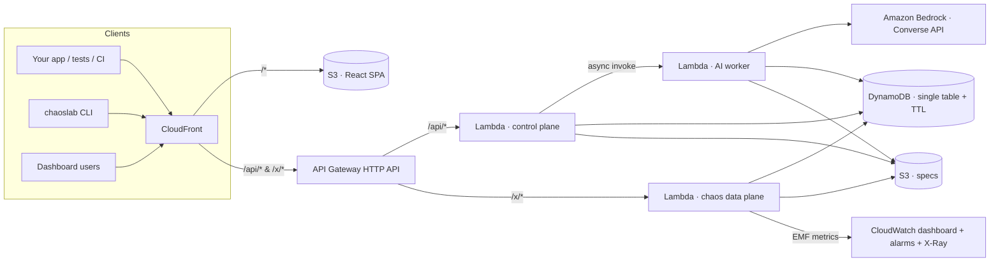

<div align="center">

# ⚡ API Chaos Lab

### Break your APIs before your users do.

**AI-powered API resilience testing.** Paste an OpenAPI spec → get an AI-generated chaos matrix (timeouts, 429s, malformed JSON, schema drift, flaky failures…) → point your app at a chaos URL → get a **resilience score** with the fixes written for you.

[**Live demo →**](https://api-chaos-lab.vercel.app) · [Open the Lab](https://api-chaos-lab.vercel.app/app/new) · [Architecture](#architecture) · [Deploy on AWS](docs/DEPLOY_AWS.md)

</div>

---

## The problem

Every app depends on APIs that time out, rate-limit and ship breaking changes. Teams test the happy path because faking failures by hand is tedious, so failure handling ships untested:

- **Retry storms:** a naive retry loop turns a 2-second blip into a self-inflicted outage.
- **Double charges:** `POST /payments` times out, the client retries without an `Idempotency-Key`, and the customer is charged twice.
- **Silent contract breaks:** a field disappears or turns into a string, and the UI renders `NaN`, `undefined` or a white screen.

## The solution

| | |
|---|---|
| 🧠 **AI chaos matrix** | Generative AI on **Amazon Bedrock** reads your OpenAPI spec and maps endpoint *semantics* to the failures that matter. Payments get idempotency/timeout ambiguity tests, auth gets token expiry, lists get empty and bloated payloads, and reads get missing fields and drift. Each scenario includes a rationale and the expected client behavior. |
| 💥 **15 realistic faults** | Latency, hang/timeout, 500, 502 *HTML from a proxy*, 503 + `Retry-After`, 429 + `Retry-After`/`X-RateLimit-*`, malformed JSON, missing required fields, wrong types, schema drift, empty body, intermittent *fail-N-then-succeed*, 401 token expired, 409 conflict, payload bloat. |
| 🔭 **Server-side behavior analysis** *(the differentiator)* | ChaosLab sits on the server side of every request, so it sees what the client does *next*: retry storms, missing backoff, ignored `Retry-After`, non-idempotent POSTs retried without an `Idempotency-Key`, retried 4xx errors, missing client timeouts, unbounded retries. |
| 🎯 **Resilience score** | Each client (`x-chaos-client`) gets an A–F grade with evidence (event IDs), strengths and findings, tracked per run. |
| ✍️ **AI explanations & fixes** | Click any failure or finding: Bedrock explains what happened, the user impact, and writes the fix in TypeScript, Python, Go or Java. |
| 🧪 **Playground** | The same API and the same chaos, hit by two real clients side by side: *naive* (`fetch → res.json() → render`) vs *resilient* (timeout, jittered backoff, Retry-After, Idempotency-Key, boundary validation, circuit breaker, cached fallback). |
| 🚦 **CI gate** | `npx chaoslab run --min-score 80 -- npm test` starts a run, executes your tests against the chaos URL and fails the build under the threshold. |
| 🔀 **Mock *or* proxy mode** | No backend yet? Spec-faithful mocks are generated from your schemas. Have one? Requests are proxied to your upstream and chaos is injected on top. |
| 📈 **Live traffic + CloudWatch** | Requests stream in real time. On AWS, every fault is emitted as CloudWatch EMF metrics and a dashboard is provisioned automatically. |

## How it works

```
1. Paste / upload / link an OpenAPI 3.x or Swagger 2.0 spec (JSON or YAML)
2. Rules engine builds an instant baseline matrix → Bedrock refines it asynchronously
3. Swap your base URL:   https://api.example.com  →  https://<lab>/x/<projectId>
4. Run your app / tests  →  faults are injected by probability (intensity) or on demand
5. Get scored: per-client grade, findings with evidence, AI-written fixes
```

```bash
# deterministic: force a specific failure for one request
curl -i https://api-chaos-lab.vercel.app/x/<projectId>/payments -X POST \
  -H 'x-chaos-fault: rate_limit_429' -H 'x-chaos-client: my-app'

# gate CI on resilience
npx chaoslab run --api https://api-chaos-lab.vercel.app --project <projectId> --min-score 80 -- npm test
```

| Request header | Purpose |
|---|---|
| `x-chaos-client` | Names the client so its behavior is graded separately (`web`, `ios`, `worker`, `ci`). |
| `x-chaos-fault` | Forces a fault ID (`timeout`, `http_500`, `rate_limit_429`, `malformed_json`, …) or `none`. |
| `x-chaos-scenario` | Forces an exact scenario from the matrix. |
| `idempotency-key` | Recorded per request. Retries of POST/PATCH without a stable key are flagged **CRITICAL**. |

Response headers `x-chaos-fault`, `x-chaos-scenario` and `x-chaos-event` tell your tests exactly what was injected.

**Outcome beacon (optional).** The server can see retries and timing, but not whether your UI survived a corrupted `200`. `POST /x/<projectId>/__chaos/outcome` with `{ endpointKey, fault, handled, fallback }` closes that gap.

## Architecture

The target production stack is 100% serverless on AWS (CDK in [`backend/infra`](backend/infra/stack.ts)):



- **Control plane** (`/api/*`): projects, spec parsing (`$ref` resolution, Swagger 2 + OpenAPI 3), matrix CRUD, runs, analysis and AI jobs.
- **Chaos data plane** (`/x/{projectId}/{path}`): matches the request to an OpenAPI operation, builds a healthy response (schema-faithful mock or upstream proxy), selects a fault (forced header → sticky flaky state → weighted random by intensity), applies it and logs the event.
- **AI worker**: long Bedrock calls run asynchronously, outside API Gateway's 30 s limit. The model chain is set with `BEDROCK_MODEL_IDS` (any Bedrock model or inference profile, e.g. `us.amazon.nova-pro-v1:0`). Structured JSON comes from a forced tool call, with a JSON-prompt fallback, and finally deterministic templates, so the product never breaks during a demo.
- **Storage adapter**: DynamoDB + S3 on AWS, Upstash Redis on Vercel, in-memory/file locally. Same code everywhere ([`backend/src/lib/store.ts`](backend/src/lib/store.ts)).

The current public demo runs the same backend as a single Vercel function (Build Output API, see [`scripts/build-vercel.mjs`](scripts/build-vercel.mjs)). The AWS stack is ready to deploy; see **[docs/DEPLOY_AWS.md](docs/DEPLOY_AWS.md)**.

### Behavior analysis rules ([`analyzer.ts`](backend/src/lib/analyzer.ts))

Events are grouped by logical request (`client + method + path + body hash`) and split into attempt chains:

| Finding | Detection | Severity |
|---|---|---|
| Unsafe write retry | POST/PATCH retried without the same `Idempotency-Key` | critical |
| Retry storm | ≥3 retries with ⅔ of gaps < 250 ms | high |
| Ignored Retry-After | next attempt sooner than 90% of `Retry-After` | high |
| Unbounded retries | > 5 retries in one chain | high |
| No client timeout | a hung request was never abandoned/retried | medium/high |
| No backoff | all retry gaps < 100 ms | medium |
| Retried non-retryable | identical retry after 409, or repeated after 401/4xx | medium |
| Client crash | outcome beacon reported `handled: false` | high |
| Gave up on transient | no retry after a retryable 5xx/429 on an idempotent call | low |

Strengths are detected too: exponential backoff, honoring Retry-After, stable idempotency keys, client timeouts, recovery from flaky dependencies, and graceful degradation. Score = `100·e^(−Σ severity·log-count / 70)` blended 55/45 with the client-reported handled rate when beacons exist.

## Repository layout

```
backend/            TypeScript backend (shared by AWS Lambda, Vercel and local dev)
  src/lib/          openapi parser · fault engine · matrix · analyzer · AI (Bedrock) · storage adapters
  src/handlers/     api.ts (control plane) · chaos.ts (data plane) · worker.ts (AI jobs)
  infra/            AWS CDK stack (API Gateway, Lambda, DynamoDB, S3, CloudFront, CloudWatch, Bedrock IAM)
  vercel/           Vercel function entry
  local/server.ts   local dev server (in-memory store)
web/                React 19 + Vite + Tailwind v4 dashboard & landing page
cli/                zero-dependency `chaoslab` CLI (CI gate)
examples/           sample integration test used with the CLI
scripts/            Vercel build (Build Output API) · demo screen recorder
video/              demo video (Remotion + HyperFrames)
```

## Run locally

```bash
npm --prefix backend install && npm --prefix web install
npm --prefix backend run dev      # API + chaos plane on http://localhost:8787 (in-memory store)
npm --prefix web run dev          # dashboard on http://localhost:5173 (proxies /api and /x)
```

Set `AWS_PROFILE`/AWS credentials to enable Bedrock locally; without them the rules engine is used.

## Deploy

- **Vercel:** `vercel deploy --prod`. The build produces `.vercel/output` (static SPA + one Node function). Add the Upstash Redis integration (`KV_REST_API_URL`/`KV_REST_API_TOKEN`) for persistence, and optionally `AWS_ACCESS_KEY_ID`/`AWS_SECRET_ACCESS_KEY`/`AWS_REGION` for Bedrock.
- **AWS (production target):** `cd backend && npx cdk bootstrap && npx cdk deploy`. Step-by-step guide: [docs/DEPLOY_AWS.md](docs/DEPLOY_AWS.md).

## Business model

| Plan | Price | For |
|---|---|---|
| Hobby | $0 | 3 APIs, 10k chaos requests/mo |
| Pro | $29/dev/mo | unlimited APIs, 500k requests, AI reports, CI gate, proxy mode |
| Team | $199/team/mo | 5M requests, SSO, Slack alerts on score drops, scheduled game days |
| Enterprise | custom | deploy in your own AWS account, private Bedrock models, audit logs, SLAs |

**Roadmap:** gRPC/GraphQL specs · traffic replay from production logs · SDK auto-instrumentation for outcome beacons · scheduled "game days" · Slack/GitHub PR comments with score diffs · per-tenant API keys and Cognito auth.

## License

MIT
